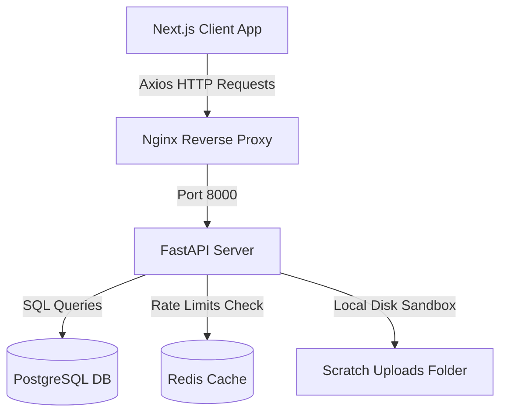
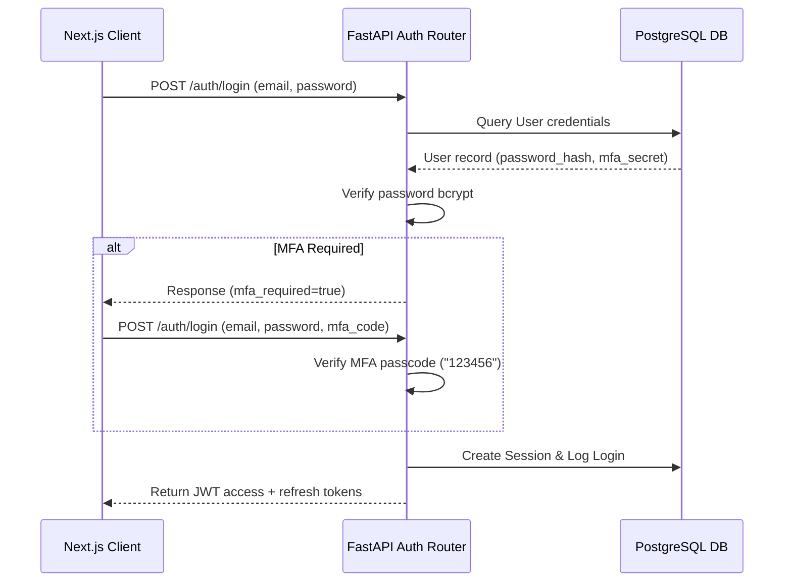

# System Architecture & Security Testing Guide

This guide documents the enterprise system architecture flow, sequence diagrams, and how to execute security validations against the vulnerable lab.

---

## 1. System Architecture

---

## 2. Sequence Diagrams

### 2.1 User Authentication Flow

---

## 3. Security Lab Verification Guide

To perform penetration testing against the security lab:

1. **Enable the Lab**: In your `.env` or system configurations, set `ENABLE_VULNERABILITY_LAB=true`.
2. **Launch the API**: Restart FastAPI.
3. **Execute SQL Injection (SQLi) Testing**:
   - Open **Burp Suite** or **OWASP ZAP**.
   - Intercept a `GET` request to: `http://localhost:8000/api/v1/vuln/sqli/user?email=admin@local.test`
   - Modify the parameter payload to: `admin@local.test' OR '1'='1`
   - Forward the request. Observe that the API returns the user details of the first user in the database, bypassing the filter.
   - *Mitigation Check*: Send the same payload to the secure `/api/v1/profile` endpoint. Notice that the backend rejects it or returns 404/401 because it uses parameter-bound ORM calls.
4. **Execute IDOR (Broken Access Control) Testing**:
   - Intercept a request to: `http://localhost:8000/api/v1/vuln/access-control/user/aa000000-0000-0000-0000-000000000001`
   - Change the UUID to any other valid user UUID in the system.
   - Observe that the response exposes name, email, and role details without checking if you own that profile.
   - *Mitigation Check*: Attempting to edit or read profiles via `/api/v1/profile` validates the token's `sub` matching the target profile resource.
