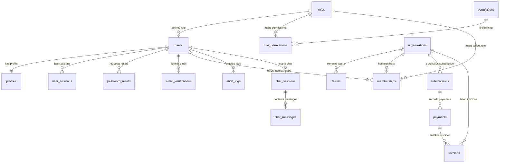

# Database Specifications & Schema Documentation

The database is built on **PostgreSQL** and strictly normalized to **Third Normal Form (3NF)**.

---

## 1. Entity-Relationship (ER) Description

---

## 2. Table Directory (18 Tables)

1. **`roles`**: Contains roles (Admin, Manager, User).
2. **`permissions`**: Fine-grained permissions (e.g., `users:create`, `org:billing`).
3. **`role_permissions`**: Many-to-many lookup for Role and Permissions.
4. **`users`**: Main credentials (email, hashed password, role_id, is_active, MFA details).
5. **`profiles`**: High-frequency user profile attributes (names, bio, phone, birth date).
6. **`organizations`**: Tenants workspaces (name, unique slug).
7. **`teams`**: Organizational divisions.
8. **`memberships`**: Connects users to organizations with org-specific roles.
9. **`user_sessions`**: Refresh token logs, user agents, IP addresses, revocation states.
10. **`password_resets`**: Dynamic password reset tokens and validation bounds.
11. **`email_verifications`**: Dynamic email verification records.
12. **`subscriptions`**: Plan tier name, period timeline, active/past_due statuses.
13. **`payments`**: Payment events, sandbox transactions, payment methods.
14. **`invoices`**: Billing receipts, invoices numbers, status (paid, open, due).
15. **`audit_logs`**: System audit logs detailing activities.
16. **`audit_trail`**: Low-level database row DML history logs.
17. **`notifications`**: User alert entries (welcome messages, verify updates).
18. **`uploaded_files`**: Document metadata, safe storage paths, MIME descriptors.
19. **`chat_sessions`**: AI conversational topics.
20. **`chat_messages`**: Conversations between users and AI assistant.
